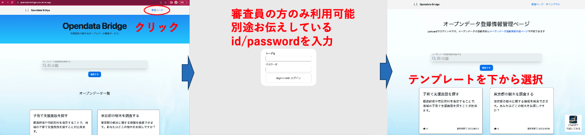
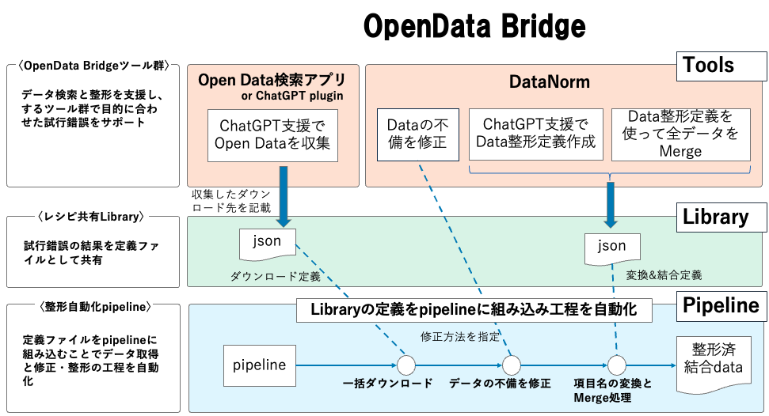

# OpenDataHackathon2023

## デモサイトと動画
### データ検索のデモ
- [Webアプリ](https://opendata-bridge-pro.vercel.app/)
  - ChatGPT支援を使った検索を行うにはID/PASSWORDを入力します
  - 
### データ検索のデモ動画
- [Webアプリ](https://youtu.be/JeJejE0zTpw)
- [ChatGPT plugin](https://youtu.be/yfqMH_vYTvU)
### データ整形のデモ動画
- [DataNorm](https://youtu.be/GS9HADN9fh8)
### データ整形自動化のデモ動画
- [データ整形自動化のデモ動画(Pipeline)](https://youtu.be/7OhWcRofCoM)

## 私達はOpenDataの「見つからない」と「形式がバラバラで使いにくい」という問題を解消し、データを作る人と使う人の架け橋を提供します。

## 着目した課題
現状、オープンデータの活用には様々な課題があります。例えば、
- 目的のデータを探すことが難しい
- 自治体ごとに項目、項目名、並びが異なる
- 処理の妨げになるような注釈の書き方がなされている

他にも様々な問題がありますが、こうした問題はデータを価値ある利用先（サービス）に結びつけることができていないため改善サイクルが回らず、データ整備を体系立てて進めるための仕組みと文化が育たなかったことが原因として考えられます。

## サービス概要
私達の**OpenData Bridge**は、オープンデータの作成・整備が促進されるような文化を育む土壌を仕組みとして提供することで、小さな改善サイクルが数多く回る状態を目指します。

### OpenData Bridgeの主な機能
- データ収集と整形を支援する**Tools**
- データ収集と整形方法を**レシピ**としてみんなで**共有するLibrary**
- データ収集と整形のレシピを入れて**整形済みデータを自動で生成するPipeline**

### OpenData Bridge全体像

### 詳細説明
- OpenData Bridge Tools
  - データ検索を支援します
    - OpenData検索 Webアプリ  [使ってみる(要id/password)](https://opendata-bridge-pro.vercel.app/) , [デモ動画](https://youtu.be/JeJejE0zTpw)
    - ChatGPTプラグイン  [JapanOpen Data](https://github.com/FooQoo/japan-opendata-chatgpt-plugin/blob/develop/docs/usage.md), [デモ動画](https://youtu.be/yfqMH_vYTvU)
    - [ChatGPTプロンプトテンプレート](https://github.com/dx-junkyard/OpenDataHackathon2023/tree/main/prompt_template)
  - データ整形を支援します
    - [DataNorm](https://github.com/dx-junkyard/OpenData-Bridge-DataNorm#%E5%AE%9F%E8%A1%8C%E6%96%B9%E6%B3%95-a-%E5%A4%89%E6%8F%9B%E5%AE%9A%E7%BE%A9%E3%81%AE%E4%BD%9C%E6%88%90%E3%83%9E%E3%83%BC%E3%82%B8)の提供、 [デモ動画](https://youtu.be/GS9HADN9fh8)
- Library
  - データの収集・整形レシピを共有し、データ整備できる人を増やします
    - [データ収集レシピ](https://github.com/dx-junkyard/OpenData-Library/tree/main/resources_configs)
    - [データ整形レシピ](https://github.com/dx-junkyard/OpenData-Library/tree/main/converters)
  - 整備したデータを共有し、一つでも多くのサービスで利用できる状態にします
- Pipeline
  - データ収集、整形のレシピを組み込んでデータ整備を自動化します
    - [手元でPipeline実行](https://github.com/dx-junkyard/OpenData-Bridge-DataNorm#%E5%AE%9F%E8%A1%8C%E6%96%B9%E6%B3%95-b-pipeline%E3%81%A7%E8%87%AA%E5%8B%95%E5%8C%96)
    - [github actionsでPipelineを定期実行](https://github.com/dx-junkyard/OpenData-Bridge-DataPipeline)

## ハッカソンでの発表
- First Stage 2023-09-10
  - [発表資料](OpenData-Bridge_ODH23_0910.pdf)、[YouTube](https://www.youtube.com/watch?v=TiiDAus5tUk&t=7033s)
- Final Stage 2023-10-22
  - [発表資料](OpenData-Bridge_ODH23_1022.pdf)

## 連携サービス
[都知事杯OpenDataHackathon2023](https://odhackathon.metro.tokyo.lg.jp/) において下記の参加チームの開発サービス向けに、使用されるデータの整備や、データ検索＆整形など本プロジェクトのツール群を使ったサポートを実施しております。
- 「オープンデータスゴイ！」【連携済】オープンデータの「宝探し」を終わらせよう！〜「使えるデータ」を使ってもらう」ために〜[FirstStageの発表](https://www.youtube.com/watch?v=TiiDAus5tUk&t=4199s)
- 発表ID 7  「シェアード法令(SLO)」 【調整中】根っこから！パブリックを動かすルールを学び合うプラットフォーム [FirstStageの発表](https://www.youtube.com/watch?v=TiiDAus5tUk&t=1640s)
- 発表ID 40 「こそだてっく」 【連携済】[子育て困り事解決ポータル（デモサイト）](https://preview.studio.site/live/V5a7JbynqR) [FirstStageの発表](https://www.youtube.com/watch?v=TiiDAus5tUk&t=7391s)
- 発表ID 41 「マイナセーフティ」 【調整中】災害時に近くの人と助け合える仕組み [FirstStage](https://www.youtube.com/watch?v=TiiDAus5tUk&t=7033s)

データ検索、整形などでお手伝いできそうなサービスがあればご連絡ください。

## FAQ
[FAQ Page](Sep10-2023_FAQ.md)

## リンク
- [JapanOpenData プラグイン](https://github.com/FooQoo/japan-opendata-chatgpt-plugin/blob/develop/docs/usage.md)
- [JapanOpenData用プロンプトテンプレート集](https://github.com/dx-junkyard/OpenDataHackathon2023/tree/main/prompt_template)
- [データ変換の仕組み](https://github.com/dx-junkyard/OpenData-Bridge-DataNorm)

## 連絡先
[https://www.dx-junkyard.com/](https://www.dx-junkyard.com/)  

