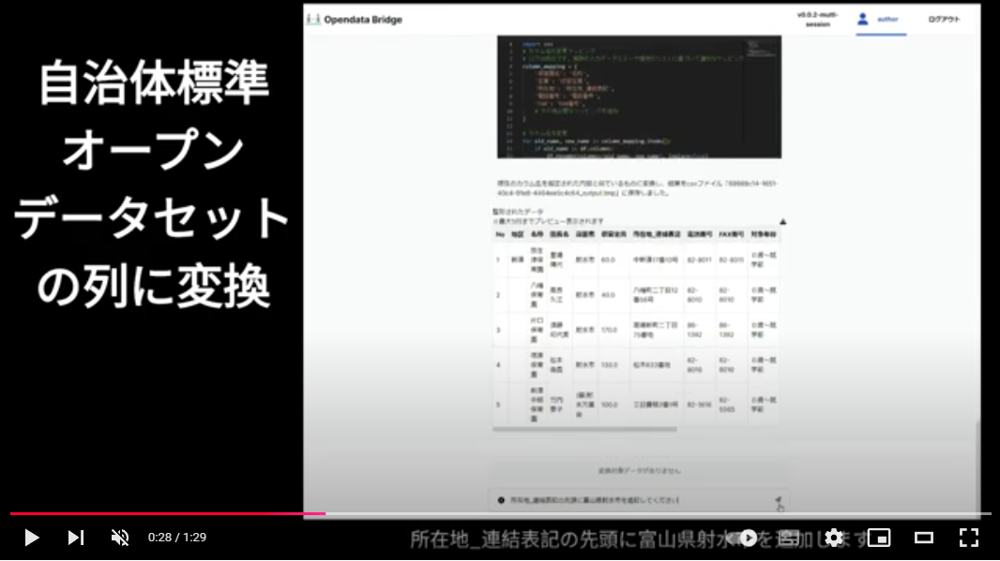
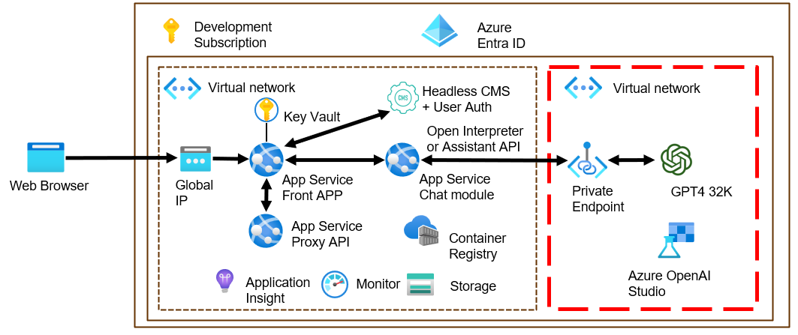

# OpenData Bridge の技術詳細

OpenData Bridge (以下、ODB) は生成AIを用いてデータ整備を行います。生成AIによるハルシネーション回避と、プロンプト操作負担を軽減するため、生成AIでデータ整備するPythonコードを作成してPythonコードがデータ処理をすることが特徴です。

Azureクラウドで実装していますが、開発のためローカル環境で動かすこともできます。

## ODB利用の流れ

ユーザーはODBを開いたらユーザー認証をしてチャット画面を開きます。チャット画面の左側に + 記号がありますので、それをクリックするとファイルのアップロードができます。データ変換したい元データを + 記号でアップロードします。

続いて、プロンプト入力欄に処理をしたい内容を書き込みます。デフォルトでは「データをCSVに変換してください」と入っていますので、そのままでもいいでしょう。
入力欄は小さいですが、プロンプトの入力可能文字数は生成AIの設定にもよりますが数百行でも入力できます。

プロンプトを入力し終えたら、入力欄の右にある紙飛行機アイコンをクリックして実行します。紙飛行機アイコンが || という停止マークに変わるはずです。停止マーク中は処理が継続しています。

ODBはプロンプトの内容を読み込んで、その処理を実現するPythonコードを作成します。プロンプトの出力は白背景ですが、Pythonコードは黒背景です。Pythonコードが正しく作成できたら、内部で実行されてアップロードしたファイルがCSVに変換されます。

変換されたCSVは表形式で表示されます。表形式表示の右上にダウンロードアイコンがありますので、それをクリックして変換後のCSVをダウンロードしてください。

変換されたCSVは一回では期待値の内容にはならないと思います。プロンプトで行を入れ替えたり、複数のデータをマージしたり、外部APIを使って不足するデータを補完するなど希望する形式まで処理を繰り返してください。希望する形式になるまで、プロンプトのやり取りを10回程度、時間にして30分以上は行うものと思います。

希望するCSVをダウンロードできたら、今まで作成したPythonコードを保存しましょう。Pythonコードの右上にコピーアイコンとダウンロードアイコンがあります。複数のPythonコードがあると思いますので、それを集めて再整理すると、今までプロンプトでやってきた処理を再現できるPythonコードが作れます。この、プロンプトのやり取りを反映させたPythonコードのことを「レシピ」と呼んでいます。

## ODBを構成するソースコード

1. [FrontEnd](https://github.com/dx-junkyard/opendata-bridge-frontend)
: チャット画面を表示します。すべてのサービスを統合してODBをアプリケーションとして表示します。Next.js ベースで実装されています。
1. [Headless CMS](https://github.com/dx-junkyard/opendata-bridge-cms)
: チャット画面の内容を保持します。ユーザー認証もここを使用しています。 [Strapi](https://strapi.io/) をベースに実装実装されています。
1. [Interpreter](https://github.com/dx-junkyard/fast-api-with-open-interpreter)
: プロンプトの解釈と、生成AIが作成したPythonコードの実行を担います。OSS である Open Interpreter の初期実装をForkして作成しております。
1. [ProxyAPI](https://github.com/dx-junkyard/OpenData-Bridge-proxy-api)
: 外部APIを呼び出すときにAPI Keyをプロンプトの中に直接書くと漏洩の危険があるため、このシステムでAPI Keyを代替します。

## ODB構成要素

ODBはAzureクラウド内に実装されています。開発のためにローカルで動かすこともできます。上図の茶色の枠の中がAzureクラウドです。赤枠の中は専用の閉鎖環境になっておりプライバシーが保護されます。

処理は以下のように流れます。

1. Web BrowserでODBのページを開く
1. Global IPを通してApp Service Front Appにアクセスする。
ここでは **FrontEnd** が動いています。
1. Headless CMSにアクセスをしてユーザー認証を行い、表示内容を取得します。ここでは **Headless CMS** が動いています。
1. Headless CMSから表示内容を取得すると、**FrontEnd** 上でチャット画面が表示できます。
1. チャット画面から元データをアップロードします。アップロードされたファイルは **Storage** に保存されます。
1. プロンプトを入力して実行します。
1. **FrontEnd** がプロンプトにシステムプロンプトと、アップロードされたファイルの **Storage** 上のURLを添付して、App Service Chat moduleをFastAPI経由で呼び出します。ここでは **Interpreter** が動いています。
1. **Interpreter** は渡された **Storage** 上のURLとプロンプトを **GPT4 32K** に渡します。
1. **GPT4 32K** は渡されたプロンプトに従ってURLのファイルを処理するPythonコードを生成して **Interpreter** に返します。
1. **Interpreter** はPythonコードを実行して、URLのファイルを更新します。
1. **FrontEnd** はプロンプト処理の返信を **Interpreter** から受け取って、URLのファイルをCSVとして表形式表示します。

## Azure上のサービス
ODB構成要素の中で使用しているAzureサービスを説明します。クラウド動かすために必要だったり、ローカルでは代用したりもできるもので、Azure以外のクラウドでも同様の実装は可能です。

- Container Registry: FrontEndやInterpreter、CMS、ProxyAPIなどをDeployするためのコンテナイメージを収容します。Localで動かす場合はDockerコマンドで代用できます。
- Storage: Azure BLOB StorageサービスでFrontEnd、Interpreter、GPT4が同一のファイルにアクセスできるようにします。Localで動かす場合はローカルのファイルで大丈夫です。
- その他: Azureの運用管理に必要なサービス群です。(Key Vault, Insight, Monitor, etc...)

## Localで動かすための生成AIについて
GPT4はクラウド上のものを利用しても良いのですが、トークン費用が掛かってしまうため、Local LLMを使うとよいでしょう。WindowsならLM Studioを使うとAMDやnVidiaのGPU機能を有効に使ってくれます。Macの場合はollamaを使うとARM系チップの優位点が活かされます。**Interpreter** には簡単なllamaが内蔵されていますので、動作確認だけならそれを使うのが良いでしょう。

## 連絡先
OpenData Bridgeやデモ動画に関するご質問、その他のお問い合わせはこちらからお願いいたします。
[https://www.dx-junkyard.com/](https://www.dx-junkyard.com/)

